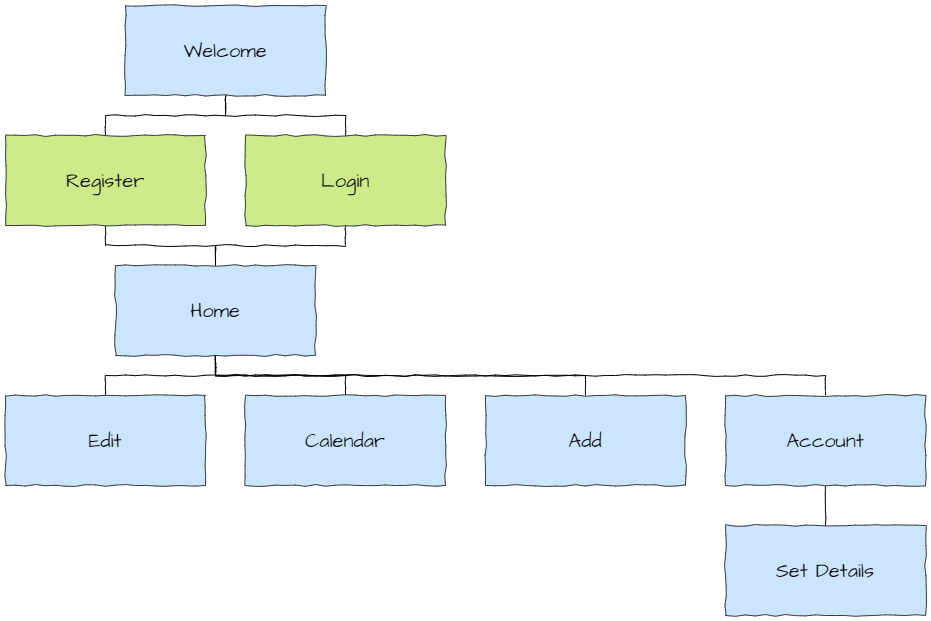
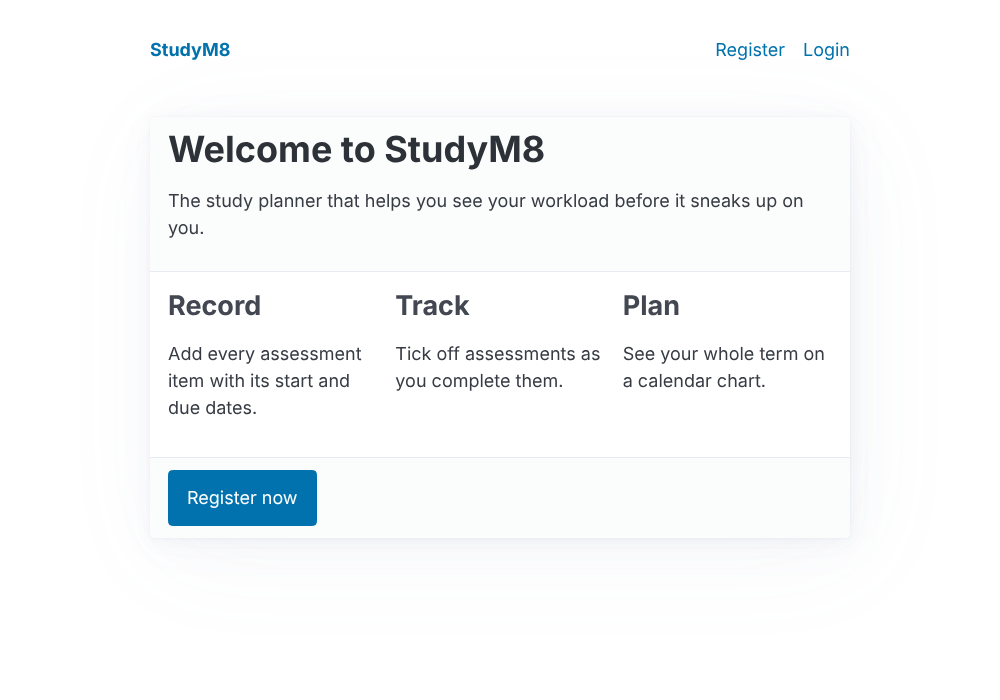
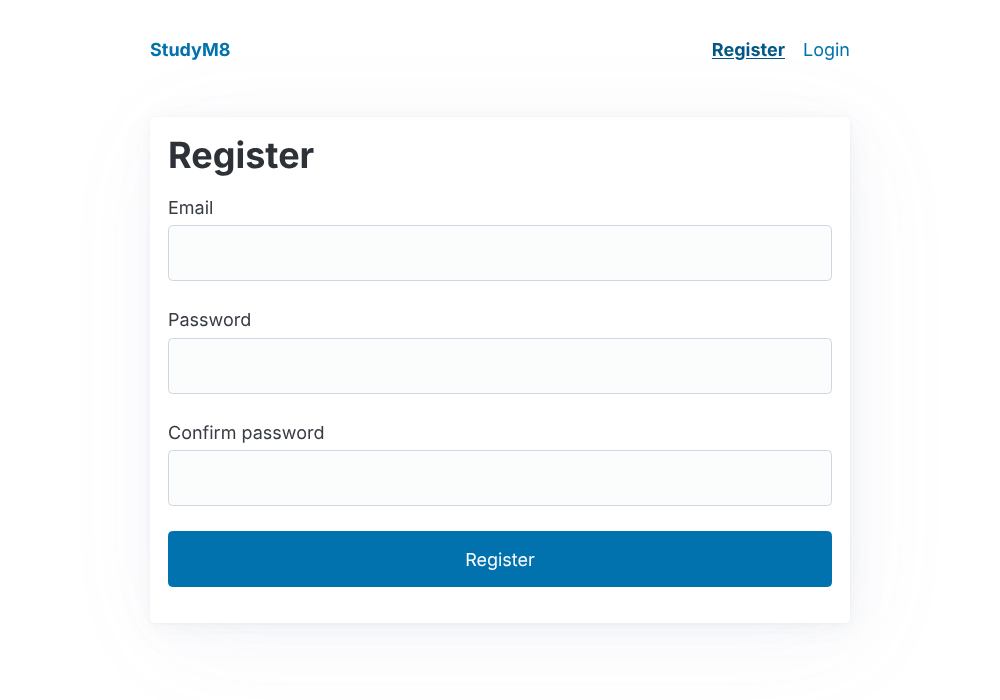
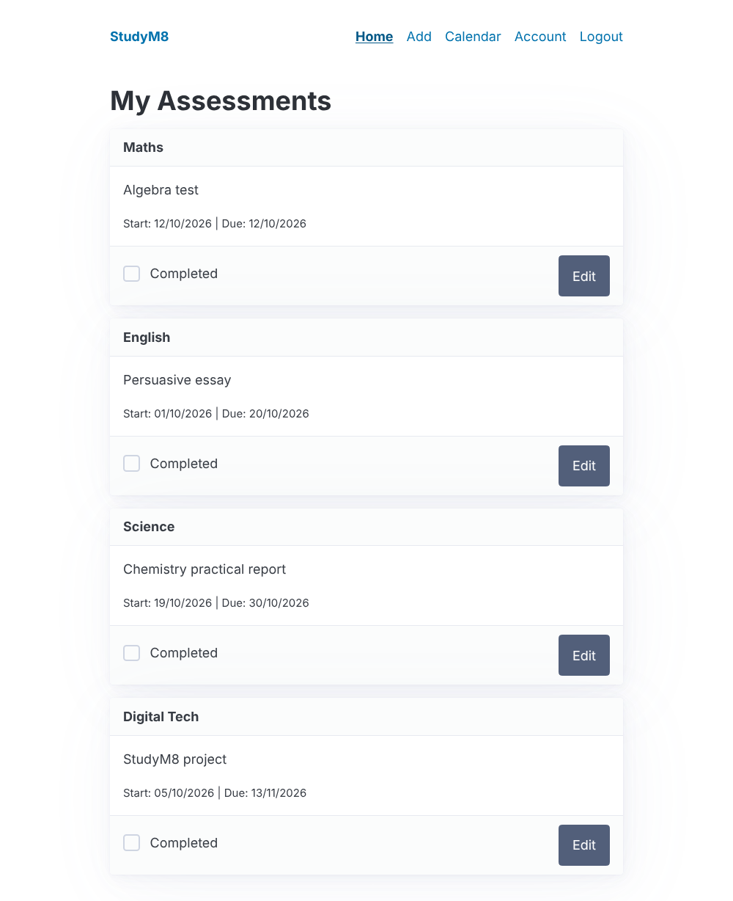
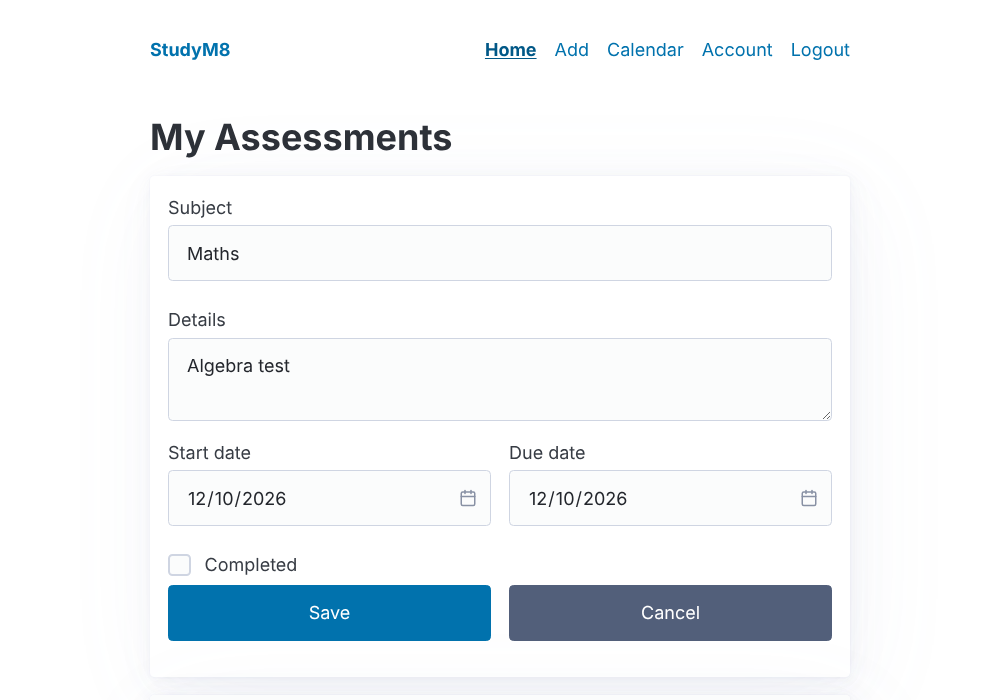
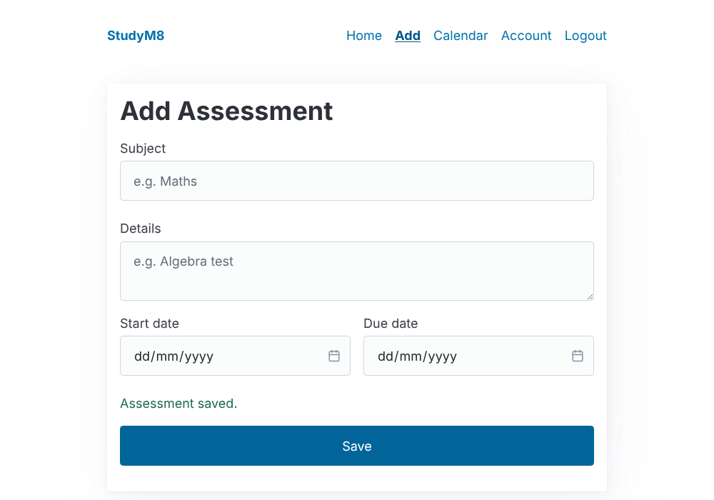
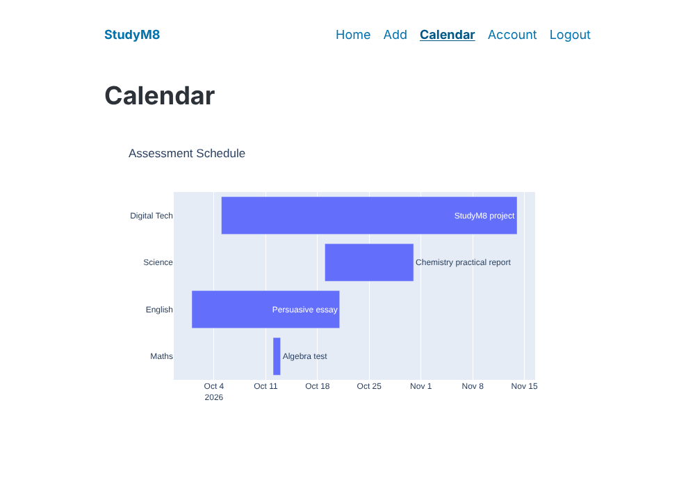
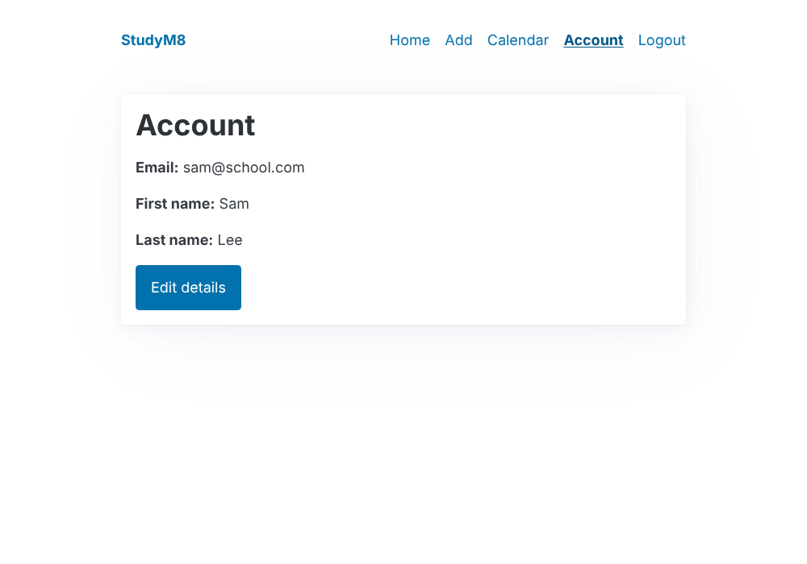
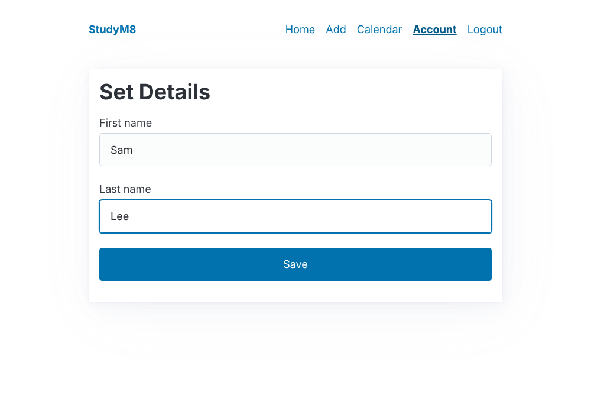

# StudyM8 Design

!!! learn "On this page we will learn"
    - what each page of StudyM8 does
    - how the pages link together
    - which web addresses (routes) our server needs
    - how StudyM8 stores its data

Before we write any code, we need to know what we're building. Professional developers plan a website's pages, the links between them and the data it stores before they start coding. Let's look at each part of the StudyM8 design.

## Site map

A **site map** shows all the pages of a website and how they connect.

- the **Welcome** page is what visitors see before they log in
- visitors can **Register** a new account or **Login** to an existing one
- once logged in, users land on the **Home** page, which lists their assessments
- from there they can **Edit** an assessment, see the **Calendar**, **Add** an assessment or check their **Account**
- the **Account** page leads to **Set Details**, where users change their name

## Pages

Here's what each page will look like when we've finished. Every page shares the same menu bar at the top. The part underneath the menu is the only part that changes.

### Welcome

The public landing page. It explains what StudyM8 does and invites visitors to register.

### Register and Login

Forms for creating an account and logging in.

### Home

Shows each outstanding assessment as a card, with the soonest due date first. Ticking **Completed** removes the card, and **Edit** turns the card into a form.

### Edit

The edit form replaces the assessment's card on the Home page, so we can change an assessment without leaving the page.

### Add

A form for adding a new assessment.

### Calendar

A chart showing when each outstanding assessment starts and is due, so we can see when our workload is heaviest.

### Account and Set Details

The Account page shows the user's details. The Set Details page lets them change their first and last name.

## Routes

Every page needs its own web address. In Flask, each address is called a **route**. A route also says which request methods it accepts: `GET` to ask for a page, and `POST` to send form data.

| Route | Methods | Purpose |
| :-- | :-- | :-- |
| `/` | GET | Welcome page, or Home if logged in |
| `/register` | GET, POST | show and process the register form |
| `/login` | GET, POST | show and process the login form |
| `/logout` | POST | log the user out |
| `/home` | GET | list outstanding assessments |
| `/add` | GET, POST | show and process the add form |
| `/assessments/<id>` | GET | one assessment's card |
| `/assessments/<id>/complete` | POST | mark an assessment as completed |
| `/assessments/<id>/edit` | GET, POST | show and process the edit form |
| `/calendar` | GET | the calendar chart |
| `/account` | GET | the user's details |
| `/account/details` | GET, POST | show and process the set details form |

## Data

StudyM8 needs to store two kinds of things: **users** and **assessments**. In a database, each kind of thing gets its own **table**. Each table has **columns** (the pieces of information we store) and **rows** (one for each user or assessment).

### users table

| Column | Type | Description |
| :-- | :-- | :-- |
| id | integer | a unique number for each user |
| email | text | the user's email address, used to log in |
| password_hash | text | a scrambled version of the user's password |
| first_name | text | the user's first name |
| last_name | text | the user's last name |

### assessments table

| Column | Type | Description |
| :-- | :-- | :-- |
| id | integer | a unique number for each assessment |
| user_id | integer | the `id` of the user the assessment belongs to |
| subject | text | the subject, for example Maths |
| details | text | what the assessment is, for example Algebra test |
| start_date | text | the date we start working on it |
| due_date | text | the date it's due |
| completed | integer | `0` if it's still to do, `1` once it's completed |

The `user_id` column links each assessment to the user who owns it. This means lots of users can use StudyM8 at the same time, and each one only sees their own assessments.

!!! tip "Never store passwords"
    Notice the users table doesn't have a `password` column. Storing passwords is dangerous: if someone steals the database, they get everyone's passwords. Instead we store a **hash**, a scrambled version of the password that can't be turned back into the original. We'll learn how this works when we build the Register page.

Now that we know what we're building, it's time to set up our computer.
