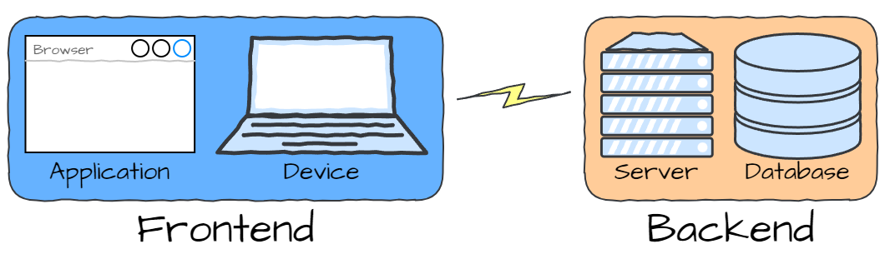

# How Websites Work

!!! learn "On this page we will learn"
    - the difference between the frontend and the backend
    - how a browser and a server talk to each other using requests and responses
    - what HTML, CSS and JavaScript each do
    - where Flask, HTMX, SQLite and Pico fit in

## There is no cloud

We've all heard about "the cloud" as the place where our files live when they aren't on our device. It often seems like our computers are connected to some mysterious thing that magically stores and provides information.

This is an over-simplification used for marketing. It lets non-technical people understand enough to use the internet. To build websites, we need a more technical understanding of how the web works.

## Frontend and backend

In truth there is no cloud; it's just someone else's computer. The diagram below is a better picture of how we access websites. It's still simple, but it's enough for what we need.

The **frontend**:

- is the part that runs on our device, inside the web browser
- is also called the **client side**
- is the part users interact with directly: the layout, design, buttons, images and forms

The **backend**:

- is the part that runs on the web server
- is also called the **server side**
- is remote from our device and is reached through the internet
- handles processing, storing and retrieving data, so the frontend gets the information it needs to show the user

### The web restaurant

The easiest way to think about the frontend and the backend is to imagine eating at a restaurant. The frontend is like the waiter and the backend is like the chef:

- the waiter gives us the menu so we can choose our meal
- the waiter takes our order and gives it to the chef
- the chef uses ingredients from the pantry to cook our order
- the waiter brings our meal back to us

Notice that:

- all our interactions with the chef go through the waiter
- the waiter doesn't do any of the cooking
- the chef needs stored ingredients to complete our order

## Requests and responses

The browser and the server talk to each other with messages. The browser sends a **request** and the server sends back a **response**. This conversation follows a set of rules called **HTTP** (HyperText Transfer Protocol).

So let's think about what happens when we type a web address into the browser:

1. The browser sends a request to the server, asking for the page at that address.
2. The server works out which page was asked for, and builds it.
3. The server sends a response back to the browser. The response holds the page and a **status code**.
4. The browser reads the response and shows the page on our screen.

Every request has a **method** that says what kind of request it is. We'll use two:

| Method | Used for | Example |
| :-- | :-- | :-- |
| `GET` | asking for something | showing the Home page |
| `POST` | sending something to the server | submitting a form to add an assessment |

The status code tells the browser how the request went:

| Code | Meaning |
| :-- | :-- |
| `200` | OK: here's what you asked for |
| `302` | Found: go to a different address instead |
| `404` | Not found: there's nothing at this address |
| `500` | Internal server error: the server's code crashed |

## What's in a web page?

A web page is made from three languages, each with its own job:

- **HTML** → the content and structure of the page (headings, paragraphs, links, forms)
- **CSS** → how the page looks (colours, fonts, spacing, layout)
- **JavaScript** → how the page behaves when we interact with it

## Where our tools fit

Now that we know the parts of a website, let's place each of our tools:

| Part | Tool | Job |
| :-- | :-- | :-- |
| backend | Python and **Flask** | receives requests, runs our code and sends back responses |
| backend | **Jinja** | builds HTML pages by putting our data into templates |
| backend | **SQLite** and SQL | stores and retrieves our users and assessments |
| backend | **Plotly** | draws the calendar chart |
| frontend | HTML | the content of our pages |
| frontend | **Pico CSS** | the styling of our pages |
| frontend | **HTMX** | swaps parts of the page when we click links and submit forms |

!!! tip "Why HTMX?"
    Normally, every time we click a link the browser asks for a whole new page and redraws everything, even the parts that didn't change, like the menu. HTMX lets the browser ask the server for just the part of the page that needs to change, and swap it in. This makes our website feel faster and smoother, and we still write it all in HTML and Python.

On the next page we'll look at the design of StudyM8.
